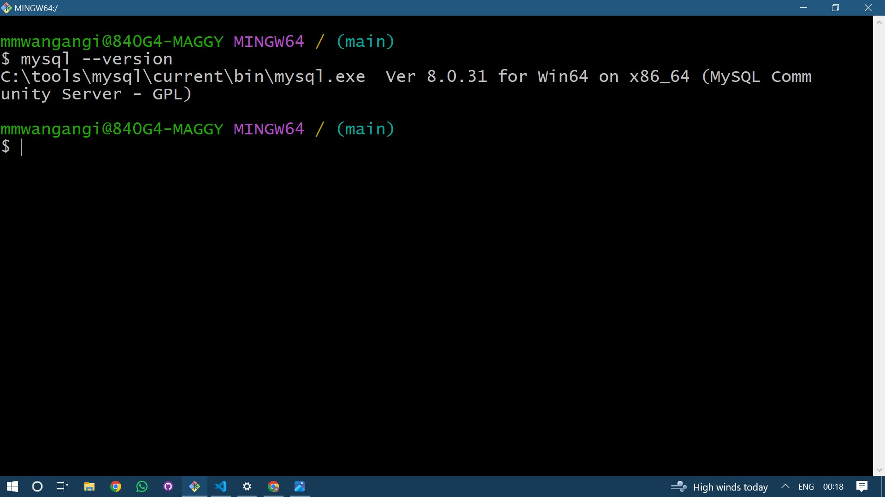

# Dev_Setup
Setup Development Environment

#Assignment: Setting Up Your Developer Environment

#Objective:
This assignment aims to familiarize you with the tools and configurations necessary to set up an efficient developer environment for software engineering projects. Completing this assignment will give you the skills required to set up a robust and productive workspace conducive to coding, debugging, version control, and collaboration.

#Tasks:

1. Select Your Operating System (OS):
   Choose an operating system that best suits your preferences and project requirements. Download and Install Windows 11. https://www.microsoft.com/software-download/windows11

2. Install a Text Editor or Integrated Development Environment (IDE):
   Select and install a text editor or IDE suitable for your programming languages and workflow. Download and Install Visual Studio Code. https://code.visualstudio.com/Download
3. Set Up Version Control System:
   Install Git and configure it on your local machine. Create a GitHub account for hosting your repositories. Initialize a Git repository for your project and make your first commit. https://github.com

4. Install Necessary Programming Languages and Runtimes:
  Instal Python from http://wwww.python.org programming language required for your project and install their respective compilers, interpreters, or runtimes. Ensure you have the necessary tools to build and execute your code.

5. Install Package Managers:
   If applicable, install package managers like pip (Python).

6. Configure a Database (MySQL):
   Download and install MySQL database. https://dev.mysql.com/downloads/windows/installer/5.7.html

7. Set Up Development Environments and Virtualization (Optional):
   Consider using virtualization tools like Docker or virtual machines to isolate project dependencies and ensure consistent environments across different machines.

8. Explore Extensions and Plugins:
   Explore available extensions, plugins, and add-ons for your chosen text editor or IDE to enhance functionality, such as syntax highlighting, linting, code formatting, and version control integration.

9. Document Your Setup:
    Create a comprehensive document outlining the steps you've taken to set up your developer environment. Include any configurations, customizations, or troubleshooting steps encountered during the process. 

#Deliverables:
- Document detailing the setup process with step-by-step instructions and screenshots where necessary.
- A GitHub repository containing a sample project initialized with Git and any necessary configuration files (e.g., .gitignore).
- A reflection on the challenges faced during setup and strategies employed to overcome them.

#Submission:
Submit your document and GitHub repository link through the designated platform or email to the instructor by the specified deadline.

#Evaluation Criteria:**
- Completeness and accuracy of setup documentation.
- Effectiveness of version control implementation.
- Appropriateness of tools selected for the project requirements.
- Clarity of reflection on challenges and solutions encountered.
- Adherence to submission guidelines and deadlines.

Note: Feel free to reach out for clarification or assistance with any aspect of the assignment.

SETTING UP DEVELOPMENT ENVIRONMENT

My operating system is Windows 11 which came preinstalled on acquiring the computer.

Following the detailed class lectures on installing vs code i visited https://code.visualstudio.com/download and installed x64bit version. This was a smooth process after which I linked it to my github account.
.png>) (screenshot showing use of vs code after installation)
Relevant extensions were installed i.e
1. python
2. pylance
3. python Debugger
4. flutter
5. dart
6. code runner
7. prettier
these extensions enhance the functionality and customization of the editor.

github account creation using email address, creating username and setting up a password after which you recieve a launchcode.
.png>)
Github is a tool for collaboration and acts as a remote repository. Already created a demo repository during class lecture and pushed a README.md file and a .txt file.
utilizing git for version control and commiting any changes before pushing it to the remote repository.
.png>)
git was properly installed and necessary programming variables i.e python, dart and flutter are up to date and on the path after setting them by editing the environment variables.

plugins i.e pip are used in python to install various packages i.e 
1. python -m pip install virtualenv
2. python -m pip install Django
3. python -m pip install upgrade pip,e.t.c

Downloading python 3.12 for windows 64bit
1. Download Python 3.12
Visit the official Python website: [Download Python 3.12](https://www.python.org/downloads/release/python-3120/)
Download the installer: Click on the "Download" button for Python 3.12 (Windows Installer).

2. Run the Installer
Locate the installer: Find the downloaded python-3.12.x.exe file (where x is the minor version number).
Run the installer: Double-click the installer to run it.

3. Install Python 3.12
Start installation:
Check the box that says "Add Python 3.12 to PATH".
Click on "Customize installation".
Customize installation (optional):
Ensure that all optional features are checked, then click "Next".
Advanced options:
Check "Install for all users".
Optionally, you can change the installation path if necessary.
Click "Install".
Complete the installation: Wait for the installation to complete, then click "Close".

4. Verify Python Installation and PATH Configuration
Check Python version:on gitbash, command prompt or powershell
python --version
You should see the output showing Python 3.12.3.

5. Manually Add Python to the PATH (if necessary)
Open Environment Variables:
Press Win + X and select "System".
Click on "Advanced system settings" on the left.
Click on the "Environment Variables" button.
Edit PATH Variable:
In the "System variables" section, find the Path variable and click "Edit".
Click "New" and add the path to your Python installation (e.g., C:\Python312\ and C:\Python312\Scripts\).
Click "OK" on all dialogs.

6. Verify PATH Configuration
Open Command Prompt again:Check Python version again:
python --version
You should see the output showing Python 3.12.3.

Python Documentation: Python 3.12 Documentation(https://www.python.org/doc/)

MySQL is an open-source relational database management system (RDBMS) that's based on structured query language (SQL)
confirming version and if its in the path 
mysql --version (on gitbash)

MYSQL installation steps
1. Download MySQL Installer
Visit the MySQL official website: MySQL Downloads (https://dev.mysql.com/downloads/installer/)
Download the MySQL Installer for Windows.
.png>)

2. Run the MySQL Installer
Locate the downloaded file (mysql-installer-community-<version>.msi) and double-click to run it.
Follow the on-screen instructions:
Choose the setup type (Developer Default)
The installer will download and install the required MySQL components.

3. Configure MySQL Server
After installation, the MySQL installer will guide you through the configuration of MySQL Server.
Set up the following configurations:
Server Configuration Type: Choose Standalone MySQL Server.
Authentication Method: Choose the appropriate method. Use Strong Password Encryption.
Accounts and Roles: Set the root password and optionally create additional MySQL user accounts.
Windows Service: Choose to run MySQL as a Windows service and select the appropriate start-up type.

4. Complete Installation
Complete the installation process by clicking through the remaining steps.
MySQL Server and Workbench should now be installed on your system.

5. Add MySQL to the PATH Environment Variable
Open the Start Menu, search for "Environment Variables", and select "Edit the system environment variables".
In the System Properties window, click on the "Environment Variables" button.
In the Environment Variables window, under the "System variables" section, find and select the "Path" variable, then click "Edit".
In the Edit Environment Variable window, click "New" and add the path to the MySQL bin directory (e.g., C:\Program Files\MySQL\MySQL Server 8.0\bin). Adjust the path according to your installation directory.
Click OK to close all windows.

6. Verify MySQL Installation
Open Command Prompt.
Type mysql --version and press Enter. You should see the MySQL version information.

7. Launch MySQL Server
Open Command Prompt.
Start the MySQL server by typing net start mysql and press Enter.

8. Connect to MySQL Server using Command Line
Open Command Prompt.
Type mysql -u root -p and press Enter.
Enter the root password you set during the installation process.

9. Launch MySQL Workbench
Open the Start Menu, search for "MySQL Workbench", and open it.
In MySQL Workbench, click on the + icon next to MySQL Connections to create a new connection.
Enter connection details such as connection name, hostname, port, username (root), and password.
Click Test Connection to verify the connection.
If successful, click OK to save the connection and double-click it to connect to the MySQL server.

MySQL Documentation (https://dev.mysql.com/doc/)

various challanges i faced while setting up the environments:
1. the current computer am using has an administrator and majority of programs and intallations required an administrators password which majority of times i could not reach them.This has prompted me to acquire my own machine before the end of the month to facilitate smooth working and progress throughout the course.

